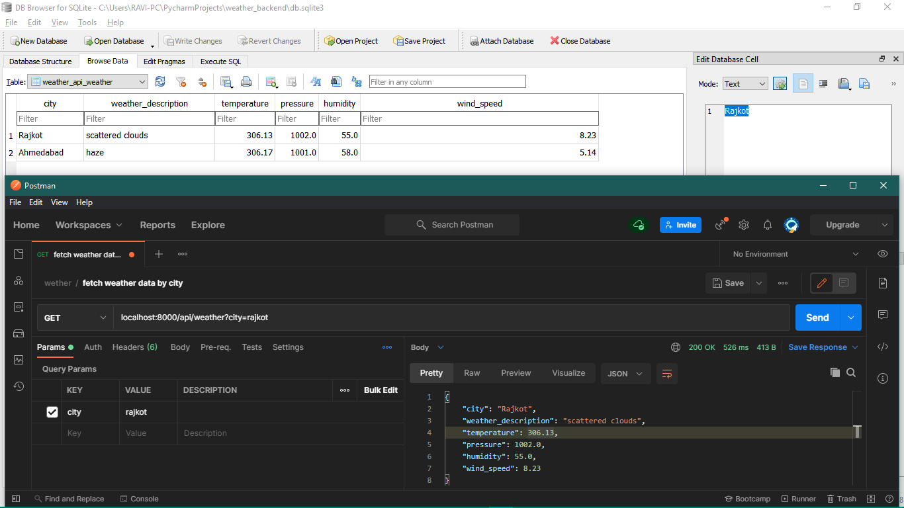
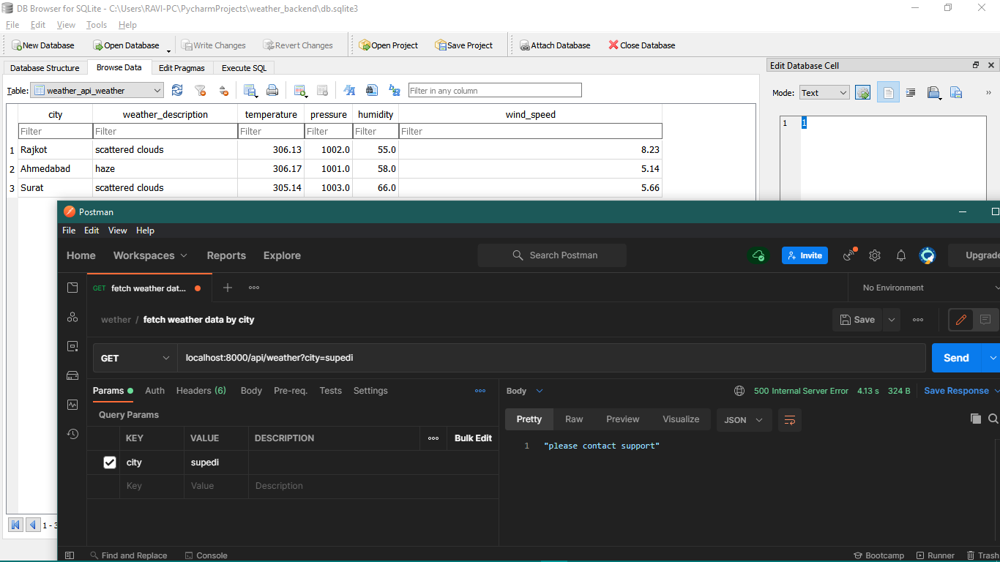
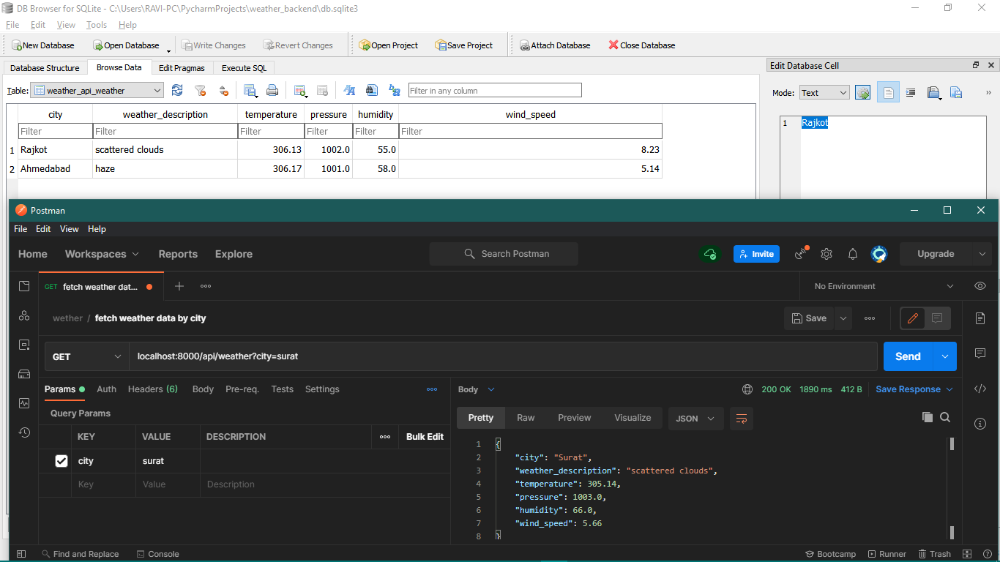
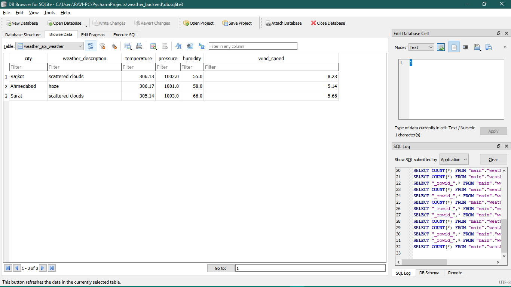

## Welcomr to wether api backnend
this project fetch weather informatiom of city.
if weather information is stored in database

**used API:**
https://api.openweathermap.org/data/2.5/weather

## Command for starting up the server in development env
`python manage.py runserver --noreload`

## API EXMPLE

